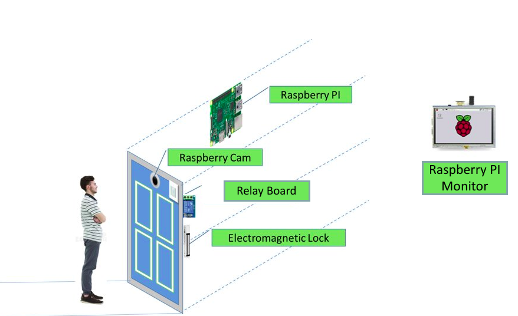
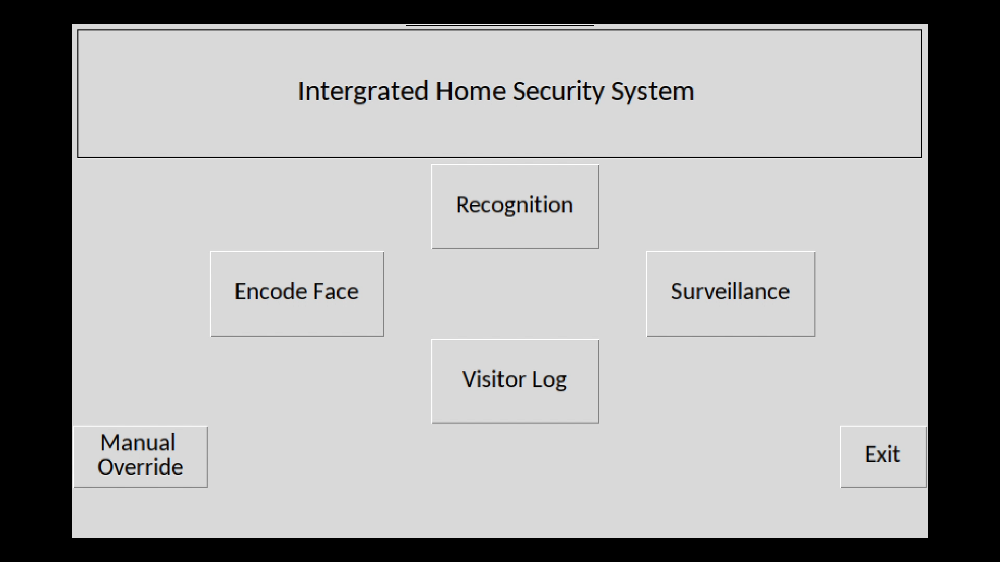
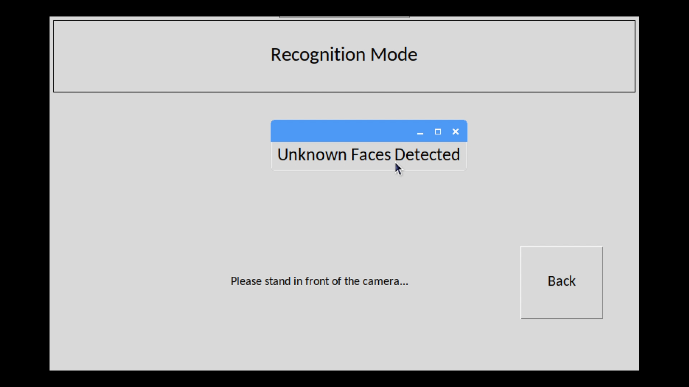

# Intergrated-Home-Security-System
A Raspberry Pi based Home Security System using Face Recognition as Authentication.

## Table of contents
* [General info](#general-info)
* [Concept Diagram](#concept-diagram)
* [Libraries Used](#libraries-used)
* [Setup](#setup)
* [Usage](#usage)
* [Features](#features)
* [Screenshots](#screenshots)
* [Inspiration](#inspiration)

## General info
​
This is an IoT based Home Security System which is deployed on a Raspberry Pi. An electromagnetic lock controlled through a relay setup by the Raspberry Pi is used for locking and unlocking the door. A Raspberry Pi Camera V2 is used as the main camera module paired with a LCD display for interacting with people at the door. This project is aimed at producing affordable security solutions with emphasis on ease of usage and intuitiveness.​

## Concept Diagram


## Libraries Used
* face_recognition
* dlib
* OpenCV
* Picamera
* RPi.GPIO

## Setup
This has been tested on a Raspberry Pi Model 3B +.

### Requirements
- Python 3.3+
- Raspbian Stretch or Jessie

### Installation
To install the required dependencies for the project:
```bash
pip install -r requirements.txt
```

To install the GPIO Module and Picamera Module:
```bash
sudo apt update
sudo apt install python3-rpi.gpio
sudo apt install python3-picamera
```

To improve recognition speed and performance, you might need to install [dlib from source](https://www.pyimagesearch.com/2017/05/01/install-dlib-raspberry-pi/)

## Usage
To execute the project:
```bash
python MainWindow.py
```

## Features
- Recognition of known faces automatically using the Camera fitted in the main Door.
- Unlocking the Door automatically for 10 Seconds to let the Resident enter the house​
- Store the pictures of people who have entered the House / Flat.
- Keep a log of known and unknown people entering the House / Flat with time stamp
- Motion sensing algorithms used to perform face detection only when someone comes in fromt of the camera
- Display a real-time Surveillance Feed for monitoring the surroundings

## Screenshots

- Home Page:<br>


- Recognition Success:<br>


- Unrecognized Face:<br>


- Surveillance:<br>


## Inspiration
- Thanks to Adam Geitgey for this great [blog](https://medium.com/@ageitgey/machine-learning-is-fun-part-4-modern-face-recognition-with-deep-learning-c3cffc121d78) explaining how face_recognition works
- Thanks to Adrian Rosenbrock for the dlib installation guide


